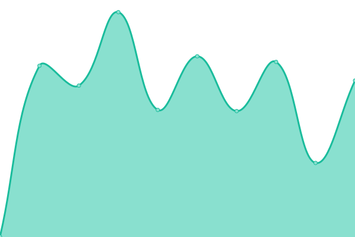
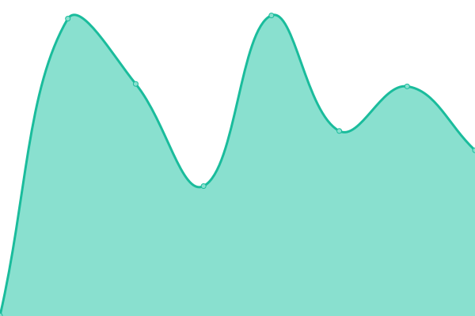

# [📈 Live Status](https://rrealmdev.github.io/realm-upptime): <!--live status--> **🟩 All systems operational**

This repository contains the open-source uptime monitor and status page for [Everyrealm Inc.](https://rrealmdev.github.io/realm-upptime), powered by [Upptime](https://github.com/upptime/upptime).

With [Upptime](https://upptime.js.org), you can get your own unlimited and free uptime monitor and status page, powered entirely by a GitHub repository. We use [Issues](https://github.com/rrealmdev/realm-upptime/issues) as incident reports, [Actions](https://github.com/rrealmdev/realm-upptime/actions) as uptime monitors, and [Pages](https://rrealmdev.github.io/realm-upptime) for the status page.

<!--start: status pages-->
<!-- This summary is generated by Upptime (https://github.com/upptime/upptime) -->
<!-- Do not edit this manually, your changes will be overwritten -->
<!-- prettier-ignore -->
| URL | Status | History | Response Time | Uptime |
| --- | ------ | ------- | ------------- | ------ |
|  [Everyrealm Main Site](https://everyrealm.com) | 🟩 Up | [everyrealm-main-site.yml](https://github.com/rrealmdev/realm-upptime/commits/HEAD/history/everyrealm-main-site.yml) | 

 402ms
     
 | 

<a href="https://rrealmdev.github.io/realm-upptime/history/everyrealm-main-site">100.00%</a>
    

|  [Everyworld Marketing Site](https://everyworld.com) | 🟩 Up | [everyworld-marketing-site.yml](https://github.com/rrealmdev/realm-upptime/commits/HEAD/history/everyworld-marketing-site.yml) | 

 360ms
     
 | 

<a href="https://rrealmdev.github.io/realm-upptime/history/everyworld-marketing-site">100.00%</a>
    

|  [Hometopia](https://hometopia.com) | 🟩 Up | [hometopia.yml](https://github.com/rrealmdev/realm-upptime/commits/HEAD/history/hometopia.yml) | 

 247ms
     
 | 

<a href="https://rrealmdev.github.io/realm-upptime/history/hometopia">100.00%</a>
    

|  [Bedlam](https://Bedlam.gg) | 🟩 Up | [bedlam.yml](https://github.com/rrealmdev/realm-upptime/commits/HEAD/history/bedlam.yml) | 

 343ms
     
 | 

<a href="https://rrealmdev.github.io/realm-upptime/history/bedlam">100.00%</a>
    

|  [RU1](https://ru1.com) | 🟩 Up | [ru-1.yml](https://github.com/rrealmdev/realm-upptime/commits/HEAD/history/ru-1.yml) | 

 418ms
     
 | 

<a href="https://rrealmdev.github.io/realm-upptime/history/ru-1">100.00%</a>
    

|  [Ringleaders Marketing Site](https://playringleaders.com) | 🟩 Up | [ringleaders-marketing-site.yml](https://github.com/rrealmdev/realm-upptime/commits/HEAD/history/ringleaders-marketing-site.yml) | 

 348ms
     
 | 

<a href="https://rrealmdev.github.io/realm-upptime/history/ringleaders-marketing-site">100.00%</a>
    

|  [Fantasy Islands](https://fantasyislands.xyz) | 🟩 Up | [fantasy-islands.yml](https://github.com/rrealmdev/realm-upptime/commits/HEAD/history/fantasy-islands.yml) | 

 90ms
     
 | 

<a href="https://rrealmdev.github.io/realm-upptime/history/fantasy-islands">100.00%</a>
    

|  [Electric Llama](https://electricllama.gg) | 🟩 Up | [electric-llama.yml](https://github.com/rrealmdev/realm-upptime/commits/HEAD/history/electric-llama.yml) | 

 550ms
     
 | 

<a href="https://rrealmdev.github.io/realm-upptime/history/electric-llama">100.00%</a>
    

|  [Jack's House](https://jackshouse.com) | 🟩 Up | [jack-s-house.yml](https://github.com/rrealmdev/realm-upptime/commits/HEAD/history/jack-s-house.yml) | 

 415ms
     
 | 

<a href="https://rrealmdev.github.io/realm-upptime/history/jack-s-house">100.00%</a>
    

<!--end: status pages-->

[**Visit our status website →**](https://rrealmdev.github.io/realm-upptime)

## 📄 License

- Powered by: [Upptime](https://github.com/upptime/upptime)
- Code: [MIT](./LICENSE) © [Everyrealm Inc.](https://rrealmdev.github.io/realm-upptime)
- Data in the `./history` directory: [Open Database License](https://opendatacommons.org/licenses/odbl/1-0/)
